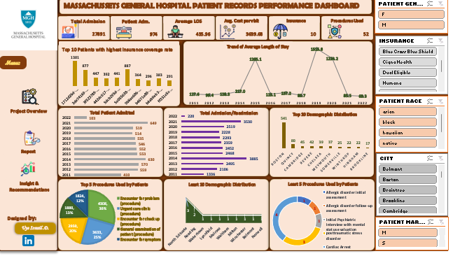

# 🏥👥📋 Hospital-Patient-Records

## 🏥 Project Title  
 **Massachusetts General Hospital – Patient Records Performance Analysis**  

---

## 📘 Project Overview  
This project leverages **synthetic healthcare data** representing ~1,000 patients from **Massachusetts General Hospital** between **2011–2022**.  
The dataset includes insights on:  
- 👤 **Patient demographics**  
- 🏦 **Insurance coverage**  
- 🩺 **Medical encounters & procedures**  

The goal is to analyze healthcare performance trends and uncover patterns that can support **better decision-making in patient care and hospital management**.  

---

## 🎯 Objectives  
- 📊 Analyze synthetic hospital records from **2011–2022**  
- 🏥 Uncover trends in **patient admissions**  
- 🏦 Examine **insurance coverage** and identify optimization opportunities  
- 💵 Assess **healthcare costs** over time  
- 🩺 Review the **procedures used** and their frequency  
- 👤 Explore **demographic distributions** among patients  
- ⚙️ Provide insights to assist hospital management in:  
  - Enhancing **operational efficiency**  
  - Improving **resource planning**  
  - Optimizing **insurance strategies**  

---

## 🛠️ Tools & Technologies  
- 💻 **Microsoft Excel** → Dashboard design, data visualization & analysis  
- 📂 **Hospital Patient Records Dataset** - Provided by *Maven Analytics* for realistic healthcare insights  

---

## 🌐 Live Dashboard  
Experience the interactive dashboard live here:
[Click to view the live dashboard](https://1drv.ms/x/c/a145471cdb65b729/ET0vXtf3-jpOmitFPfvfSXUB64-N09iShf5wZdZ5mzGU-A?e=lSUNvp)

---

## 🎯 Purpose  
This project analyzes **synthetic hospital records (2011–2022)** to uncover trends in:  
- 👥 Patient admissions & readmissions  
- 🏦 Insurance coverage gaps  
- 💵 Healthcare costs  
- 🩺 Procedure usage & coverage  
- 📊 Demographic distributions  

The goal is to support **hospital management** in enhancing ⚙️ **operational efficiency**, 📅 **resource planning**, 💸 **cost management**, and 🛡️ **insurance optimization**.  

---

## 📊 Key Insights from Dashboard  
- 🏥 **Total Admissions/Readmissions:** 27,981  
- 👤 **Total Patients Admitted:** 974  
- ⏱️ **Average Length of Stay:** 435.96 minutes  
- 💰 **Average Cost per Visit:** $3,639.68  
- 🛡️ **Procedures Covered by Insurance:** 10  
- 🧾 **Procedures Used:** 52

---

## 🖼️ Dashboard Preview 

---

## ❓ Key Business Questions Answered  
- 📈 What are the **trends** in patient admissions and readmissions over time?  
- ⏳ How does the **average hospital stay duration** vary across years?  
- 💵 What is the **average cost per hospital visit**?  
- 🛡️ How many **procedures are covered by insurance**?  
- 🩺 What are the **most and least common procedures**, and how do demographics influence them?  

---

## 🔎 Key Insights  
- 📈 **Admission Trends:** Admissions rose sharply post-2020, likely due to external factors (e.g., pandemic). Boston remains the main hub, signaling resource optimization needs.  
- ⏳ **Length of Stay:** Decline in LOS suggests improved care/discharge practices, but very short stays (2022) raise quality concerns.  
- 🛡️ **Insurance Gaps:** Only 10 of 52 procedures are covered by insurance → most are out-of-pocket, risking patient access and satisfaction.  
- 💸 **Cost Distribution:** Average visit cost of ~$3,640 highlights affordability issues; insurance expansion could improve accessibility.  
- 🌍 **Demographics:** Most patients are from Boston & nearby cities → useful for resource allocation and service expansion.  

---

## 💡 Recommendations  
- 🤝 **Optimize Insurance Partnerships:** Expand coverage for high-demand procedures (e.g., urgent care, symptom evaluations).  
- 🏥 **Improve Short-Stay Care:** Audit 2022 short stays to ensure quality and avoid premature discharges.  
- 📊 **Predictive Modeling:** Forecast staffing and resource needs during high-admission years (2021–2022).  
- 📢 **Targeted Outreach:** Run awareness & outreach programs in underrepresented cities to improve access.  
- 💵 **Cost Review:** Analyze cost drivers of common procedures and explore reduction strategies without sacrificing care quality.  

---

## 🚀 How to Use This Project  
- 📂 **Download/Clone the Repository** → Get project files on your local machine  
- 💻 **Open the Excel File** → Use **Excel 2016 or later** for best compatibility  
- 🔍 **Explore the Dashboard** → Interact with slicers, filters, and pivot visuals  
- 📈 **Analyze Trends & Patterns** → Dive into admissions, costs, demographics, and coverage gaps  
- 📝 **Apply Findings** → Translate insights into strategies for operational efficiency & patient care  

---

## 🏁 Conclusion  
This project demonstrates the power of **data-driven healthcare analysis** in improving:  
- 🏥 **Patient outcomes**  
- ⚙️ **Hospital efficiency**  
- 🛡️ **Insurance accessibility**  

By uncovering trends in **admissions, costs, and demographics**, hospitals can:  
- 🔁 Replicate best practices  
- ✅ Address care quality risks  
- 💸 Reduce financial strain on patients  
- 📅 Enhance long-term healthcare planning  

✨ Data insights like these ensure that hospitals not only treat patients but also **anticipate needs, optimize resources, and improve healthcare delivery**.  

🔗 I encourage you to explore the dashboard, test different filters, and discover how data-driven decision-making can transform business strategies.  

---

## 👨‍💻 Author  
**Ismail** – *Data Analyst | Data Enthusiast*  

I’m passionate about turning raw datasets into meaningful insights 📊. With hands-on experience in **Excel**, **SQL**, and **Power BI**, I enjoy analyzing, visualizing, and storytelling with data to support smarter business decisions 🚀.  

---

🔗 **Let’s Connect**  
- 🌐 [LinkedIn](https://www.linkedin.com/in/uye-ismail-d)  
- 📧 uyedanzismuye@gmail.com  
- 📧 uyeismaildanzismuye@gmail.com
  
💡 *"In God we trust. All others must bring data."* – W. Edwards Deming  

---

## 🙏 Closing Note  
Thank you for taking the time to explore this project 💡.  
I hope the insights and recommendations spark new ideas and inspire smarter decisions.  

Feel free to ⭐ this repo if you found it useful, and don’t hesitate to explore my other projects for more data stories 📊✨.  

I’m always open to collaboration, feedback, and knowledge-sharing; let’s connect and build something impactful together! 🤝 

